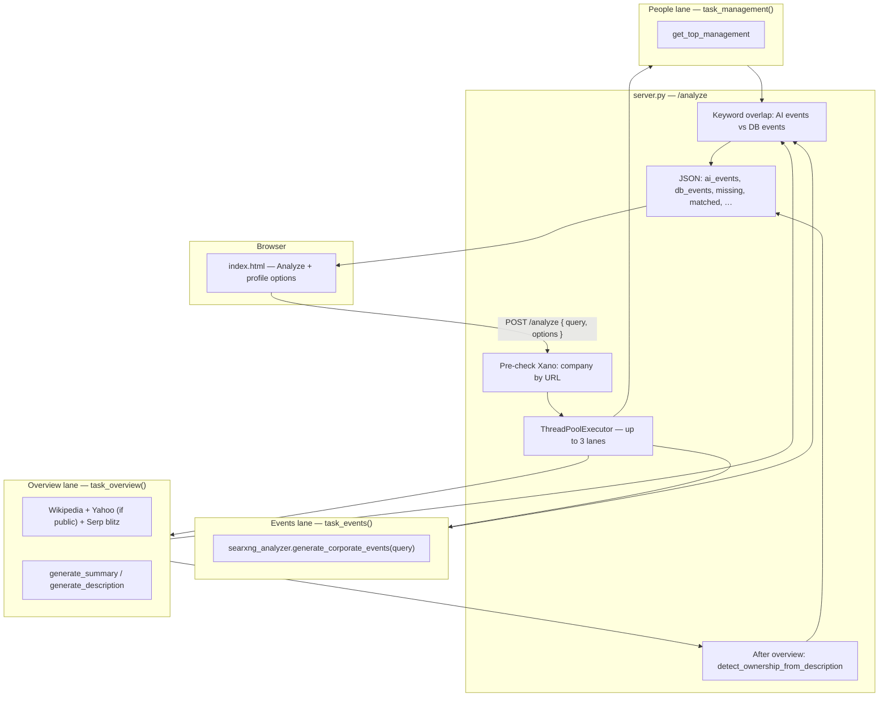
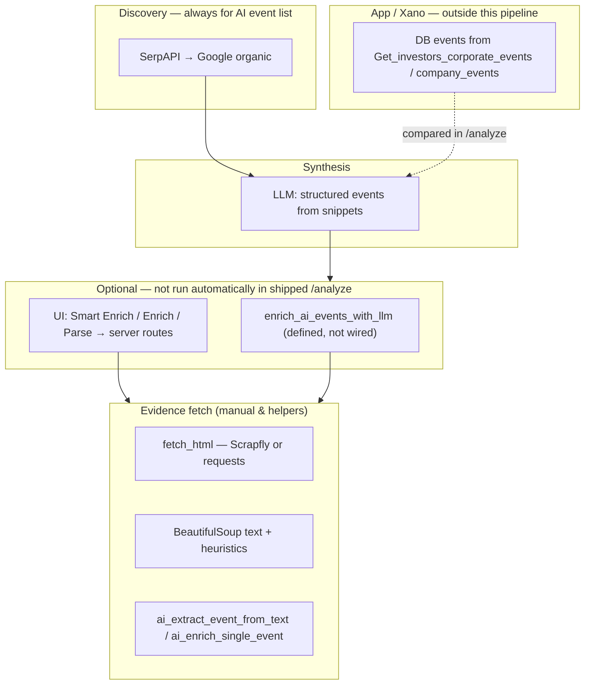
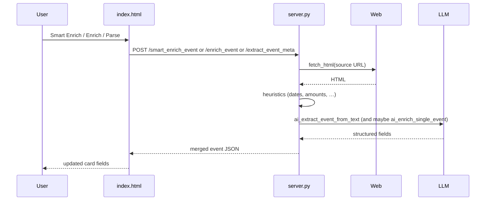

# Corporate events — search & data gathering (visual)

This document is a **picture-first** companion to:

- [`SEARCH_AND_QUERIES.md`](SEARCH_AND_QUERIES.md) — exact **SerpAPI query strings**, packs, and patterns  
- [`CORPORATE_EVENTS_ENRICH_FLOW.md`](CORPORATE_EVENTS_ENRICH_FLOW.md) — **manual enrich** endpoints after the UI loads  
- [`doc.md`](../doc.md) — full research-engine map  

**Important naming note:** corporate-event **discovery** uses **Google via SerpAPI** (parallel HTTP), not a self-hosted SearXNG instance. The repo name is historical.

---

## 1. Where corporate events fit in `POST /analyze`



**Options** (from payload) can **skip** lanes: `include_overview`, `include_events`, `include_individuals`, and counterparties are tied to events.

---

## 2. Inside `generate_corporate_events` (search → context → LLM)

```mermaid
flowchart LR
  subgraph Input
    Q["Company name or URL-derived hint"]
  end

  subgraph Classify["detect_company_type"]
    D1["3 discovery Serp queries"]
    D2["Snippet score: startup vs enterprise"]
  end

  subgraph Pack["Query pack — 1, 18, or 18 strings"]
    P1["max_events ≤ 1 → 1 minimal query"]
    P2["Startup pack — 18 queries"]
    P3["Enterprise pack — 18 queries"]
  end

  subgraph Serp["serpapi_parallel_search"]
    B["Batches of 10 concurrent requests"]
    R["Merge + dedupe by URL"]
    H["Each hit: title, snippet, link, published_date"]
  end

  subgraph Context["Context blob"]
    C["Numbered blocks: [i] title, snippet, date, Source: URL"]
  end

  subgraph LLM["OpenRouter — Claude extraction"]
    PR["Prompt: checklist + field schema"]
    OUT["JSON array of events — source_url per row"]
  end

  Q --> Classify
  Classify --> Pack
  Pack --> Serp
  Serp --> Context
  Context --> LLM
  LLM --> OUT
```



**Data gathered at this stage** is **only what Serp returns** (snippets + metadata) — **not** full article HTML. Each extracted event should carry a **`source_url`** (best article URL from context) for later enrichment.

---

## 3. Data sources stack (corporate events path)



---

## 4. Manual enrichment after cards render (high level)



See [`CORPORATE_EVENTS_ENRICH_FLOW.md`](CORPORATE_EVENTS_ENRICH_FLOW.md) for step-by-step text.

---

## 5. ASCII — one-page mental model

```
  User query (name or URL)
           │
           ▼
  ┌──────────────────────────────────────┐
  │ POST /analyze                         │
  │  • Xano pre-check → db_events        │
  │  • Parallel: overview | EVENTS | mgmt │
  └──────────────────────────────────────┘
           │
           │  EVENTS lane
           ▼
  detect_company_type (Serp × 3)
           │
           ▼
  choose 1 / 18 / 18 query strings (quoted company)
           │
           ▼
  serpapi_parallel_search → dedupe URLs
           │
           ▼
  big numbered “snippet journal” string
           │
           ▼
  Claude (OpenRouter) → ai_events[]
           │
           ├── source_url on each event (for later)
           │
           ▼
  server matches titles vs db_events → missing / matched
           │
           ▼
  UI: optional HTML fetch + LLM enrich per button (not automatic)
```

---

## 6. Files to open in the repo

| Topic | File |
|--------|------|
| Event query packs + LLM prompt | `searxng_analyzer.py` — `generate_corporate_events`, `detect_company_type` |
| Parallel search + dedup | `searxng_analyzer.py` — `serpapi_parallel_search` |
| `/analyze` orchestration | `server.py` — `analyze`, `task_events` |
| Enrich routes | `server.py` — `smart_enrich_event`, `enrich_event`, … |

---

## Viewing Mermaid

- **GitHub / GitLab**: Mermaid renders in `.md` preview.  
- **VS Code / Cursor**: use a Mermaid preview extension if the built-in preview does not render diagrams.  
- **Export**: paste diagrams into [mermaid.live](https://mermaid.live) for PNG/SVG.
